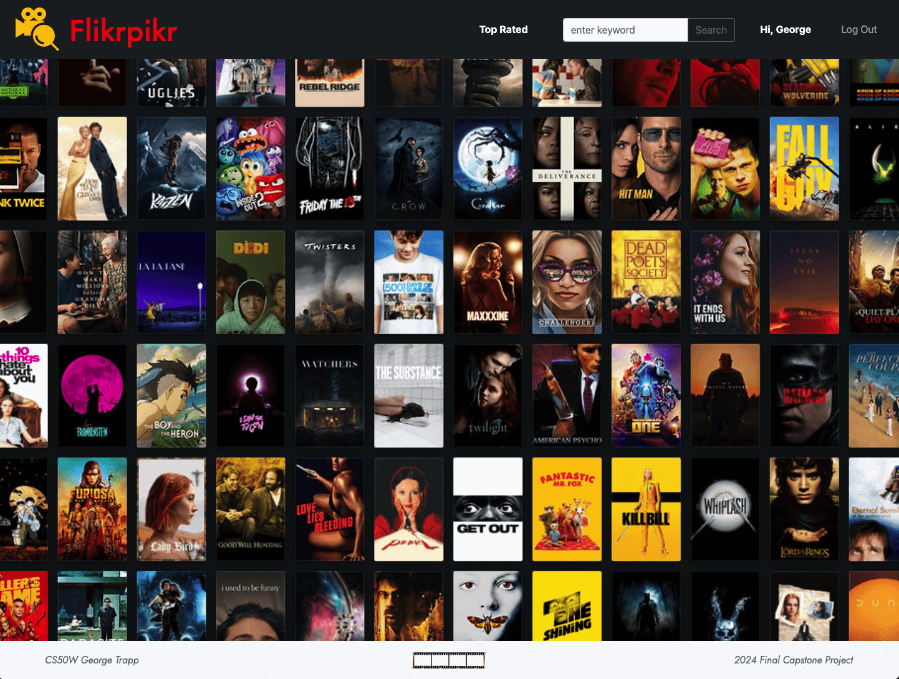

# Flikrpikr

Flikrpikr was developed as my final project for Harvard's [CS50 Web Programming with Python and JavaScript](https://cs50.harvard.edu/web/2020/) course. This web application is primarily built using Python and JavaScript, leveraging the Django framework to deliver its functionality.

[](https://www.youtube.com/@george-trapp)

### What is Flikrpikr?

Powered by the [OMDb API](https://www.omdbapi.com/), Flikrpikr is a comprehensive movie and TV show database designed for film buffs, movie lovers, and cinephiles alike. It allows users to search and view movie and TV show titles, create personalized lists, follow other movie enthusiasts, and engage with content through comments and likes. It also includes essential user management features, such as account creation, login, and logout functionality.

Watch a video walkthrough of Flikrpikr [HERE](https://youtu.be/_1kXKrSSxNw)

### Quickstart

```
# Create new migrations
python3 manage.py makemigration

# Migrate
python3 manage.py migrate

# Start development server 
python3 manage.py runserver

# In browser, navigate to generated URL (typically local host http://127.0.0.1:8000/)
```
To navigate Flikrpikr, use the app's NavBar. All pages, except the index page, require users to have an account and be signed in (visit **Register** or **Log In)**. The app's default **Index** page kicks off featuring a splash screen collage of movie posters. The **Search Field** allows users to search for titles by keyword. Clicking on a movie poster takes users to the **Details** page, where they can view full information, bookmark titles, comment on them, and like other users' comments. **Top Rated** section displays the user’s bookmarked lists and links to other users' lists. Finally, the **Profile** page shows the logged-in user's movie list along with their number of followers and users they are following.

## Backend

### File Structure

Flikrpikr adheres to the standard [Django file structure](https://django-project-skeleton.readthedocs.io/en/latest/structure.html). Python code corresponding to each of the app's 'views' (both visible and API) is stored in the file `views.py`. The site's various URL routes are defined in `urls.py`.  The app's database is organized into four key tables (User, Movie, Follow and Comment) which are defined in `models.py`, with the data stored in a `db.sqlite3` database file.

The website consists of eight HTML pages, most of which extend from a base layout file (`layout.html`) using Django's templating engine. These templates are located in the `templates` directory. The default route, `index.html`, features a graphic splash page while `search.html` enables users to search for titles by keyword. `details.html` provides comprehensive information on specific titles, along with options to bookmark, comment on, and like user comments. `profile.html` displays a user's bookmarked titles and `top-rated.html` showcases the highest-rated titles from user lists, filtered by IMDb ratings.

The `static` folder is divided into two subfolders: `media`, which holds the app’s images, and `js`, where the JavaScript files are stored. Most JavaScript files are page-specific. The custom styling for Flikrpikr is managed in `style.css`.

Beyond these core files, the app’s dependencies are listed in `requirements.txt`, while environment variables are configured in an `.env` file.

### How Flikrpikr Works

Flikrpikr is a web application built using Python, JavaScript, HTML, and CSS. It features a SQLite database, with data managed through Python-based models. The app leverages the Django full-stack framework for its backend and the Bootstrap framework for its front-end design.

The app integrates with the [OMDb API](https://www.omdbapi.com/) to enable movie and TV show searches, providing detailed information on titles. Flikrpikr includes 8 visible URL routes that render HTML pages, along with 8 API routes. These routes facilitate queries to Flikrpikr’s APIs and allow updates to the app’s database.

## Et al.

### Distinctiveness and Complexity

Built from scratch using an empty Django template, Flikrpikr incorporates many tools and techniques covered in CS50W. By integrating bookmarking and follow features through a combination of a public API and an in-built database, Flikrpikr goes beyond being a simple API querier, expanding into a fully functional website with advanced features.

Designed to tackle programming challenges, this project incorporates several techniques not covered in CS50W. It is notably more complex and larger in scope compared to the course's earlier problem sets.

In line with CS50W's grading requirements, Flikrpikr is mobile-responsive, utilizes Django with four associated models, and incorporates JavaScript as described above.

### Acknowledgements

- The Open Movie Database [OMDb API] - [LINK](https://www.omdbapi.com//)
- Boris Farias - video favicon [LINK](https://www.flaticon.com/free-icon/video_10918892?term=movie+search&page=2&position=9&origin=search&related_id=10918892/)
- CS50’s Web Programming with Python and JavaScript - [LINK](https://cs50.harvard.edu/web/2020/)


### About Me

Hello, I’m George Trapp! I’m a passionate and creative Full-stack developer with extensive experience in web and software development across diverse industries, including health, finance, and education. In addition to my coding expertise, I have a rich musical background as a cellist, holding a Bachelor of Music from The Juilliard School.

Let's connect!
 - LinkedIn - [LINK](https://www.linkedin.com/in/georgetrapp/)
 - GitHub - [LINK](https://github.com/gtrapp/)

<hr>
