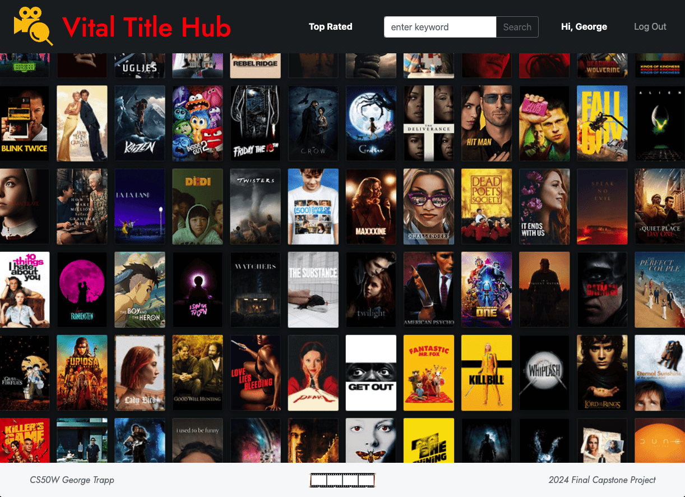

# Vital Title Hub

Vital Title Hub is designed and implemented as my final project for Harvard's [CS50 Web Programming with Python and JavaScript](https://cs50.harvard.edu/web/2020/) course. Vital Title Hub is a web application written primarily in Python and JavaScript using the Django framework.

[](https://www.youtube.com/@george-trapp)

### What is Vital Title Hub?

Using the The Open Movie Database - [OMDb API](https://www.omdbapi.com/), Title Vital Hub is a social network for cinephiles that allows users to create lists of their favorite movies, follow other movie enthusiasts, comment on movie titles, and like comments from other users.

Title Vital Hub allows users to search and view movie and TV show titles, save their favorite titles to personal lists, comment on bookmarked movies, like other users' comments, and follow fellow cinephiles. It also provides essential user management features, enabling visitors to create an account, log in, and log out of the application.

Watch a video walkthrough of Vital Title Hub [HERE](https://www.youtube.com/@george-trapp)

### Quickstart

```
# Create new migrations
python3 manage.py makemigration

# Migrate
python3 manage.py migrate

# Start development server 
python3 manage.py runserver

# In browser, navigate to generated URL (typically local host http://127.0.0.1:8000/)
```
To navigate Title Vital Hub, use the app's NavBar. All pages (except the app's index page) requires the user to have an account with the application and be signed in (go to **Register** / **Log In)**. Title Vital Hub's default **Index** page displays a splash screen movie graphic image. The **Search Field**  allows users to search for titles, view details, bookmark titles, comment on them, and like other users' comments. **Top Rated** displays the user's bookmarked lists and provides links to other users' lists.  **Profile** page shows the logged-in user's movie list along with the number of followers and users they are following.

## Backend

### File Structure

Title Vital Hub adheres to the standard [Django file structure](https://django-project-skeleton.readthedocs.io/en/latest/structure.html). Python code corresponding to each of the app's 'views' (both visible and API) is stored in the file `views.py`. The site's various URL routes are defined in `urls.py`.  The app's database is organized into four key tables (User, Movie, Follow and Comment) which are defined in `models.py`, with the data stored in a `db.sqlite3` database file.

The website consists of eight HTML pages, most of which extend from a base layout file (`layout.html`) using Django's templating engine. These templates are located in the `templates` directory. The default route, `index.html` features a graphic splash page while `search.html` enables users to search for titles by keyword. `details.html` provides comprehensive information on specific titles, along with options to bookmark, comment on, and like user comments. `profile.html` displays a user's bookmarked titles and `top-rated.html` showcases the highest-rated titles from user lists, filtered by IMDB ratings.

The `static` folder is divided into two subfolders: `media`, which holds the app’s images, and `js`, where the JavaScript files are stored. Most JavaScript files are page-specific. The custom styling for Title Vital Hub is managed in `style.css`.

Beyond these core files, the app’s dependencies are listed in `requirements.txt`, while environment variables are configured in the `.env` file.

### How Title Vital Hub Works

Title Vital Hub is a web application built using Python, JavaScript, HTML, and CSS. It features a SQLite database, with data managed through Python-based models. The app leverages the Django full-stack framework for its backend and the Bootstrap framework for its front-end design.

The app integrates with the [OMDb API](https://www.omdbapi.com/) to enable movie and TV show searches, providing detailed information on titles. Title Vital Hub includes 8 visible URL routes that render HTML pages, along with 8 API routes. These routes facilitate queries to Title Vital Hub’s APIs and allow updates to the app’s database.

## Et al.

### Distinctiveness and Complexity

Built from scratch using an empty Django template, Title Vital Hub incorporates many tools and techniques covered in CS50W. By integrating bookmarking and follow features through a combination of a public API and an in-built database, Title Vital Hub goes beyond being a simple API querier, expanding into a fully functional website with advanced features.

Designed to tackle programming challenges, this project incorporates several techniques not covered in CS50W. It is notably more complex and larger in scope compared to the course's earlier problem sets.

In line with CS50W's grading requirements, Title Vital Hub is mobile-responsive, utilizes Django with four associated models, and incorporates JavaScript as described above.

### Acknowledgements

- The Open Movie Database [OMDb API] - [LINK](https://www.omdbapi.com//)
- CS50’s Web Programming with Python and JavaScript - [LINK](https://cs50.harvard.edu/web/2020/)


### About Me

Hi, I'm George Trapp! I'm a passionate and creative Full Stack Developer with extensive experience in web and software development. I've had the opportunity to work across industries—from health and finance to education. Outside of coding, I have a deep background in music as a cellist, holding a Bachelor of Music from The Juilliard School. 

Hello, I’m George Trapp! I’m a passionate and creative Full Stack Developer with extensive experience in web and software development across diverse industries, including health, finance, and education. In addition to my coding expertise, I have a rich musical background as a cellist, holding a Bachelor of Music from The Juilliard School.

Let's connect!
 - LinkedIn - [LINK](https://www.linkedin.com/in/georgetrapp/)
 - GitHub - [LINK](https://github.com/gtrapp/)

<hr>
